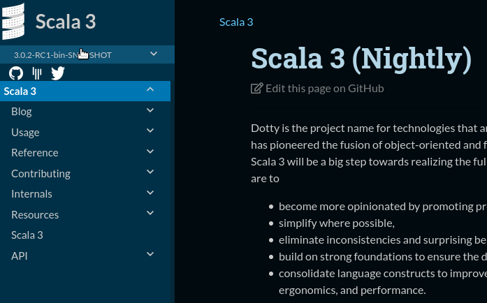

# {{ page.title }}

Scaladoc now provides convenient way to link between different versions of documentation. The feature is pretty handy if we want to expose older docs for users that didn't migrate to the new version of our library.

### How to setup it

The feature was designed for easy scalability with no need to regenerate all scaladocs after adding next version. Becuase of that we decided to introduce the new setting passed during creation of scaladoc `-versions-dictionary-url` pointing with URL to JSON document holding information about locations of specific versions. The JSON file has single property "versions" that holds dictionary of labels of specific docs and URL pointing to their index.html top-level file.

Example JSON file:
```
{
  "versions": {
    "3.0.X": "https://dotty.epfl.ch/3.0.X/docs/index.html",
    "Nightly": "https://dotty.epfl.ch/docs/index.html"
  }
}
```

This enforce us to provide the setting while genereting docs for each of the versions, however it gives us more flexebility later. Consider one want to add next version of the API docs along previous 5 versions he/she has already published. The only thing is to upload them to some web server host and update the JSON file with another entry. All scaladocs will now become aware of the new scaladoc version.

### How does it look from user perspective

Providing JSON file via `-versions-dictionary-url` enables scaladoc to link between versions. We found it convenient to change the revision label into drop-down menu that let you change between different version. Everything will change automatically, no need for further setup.


